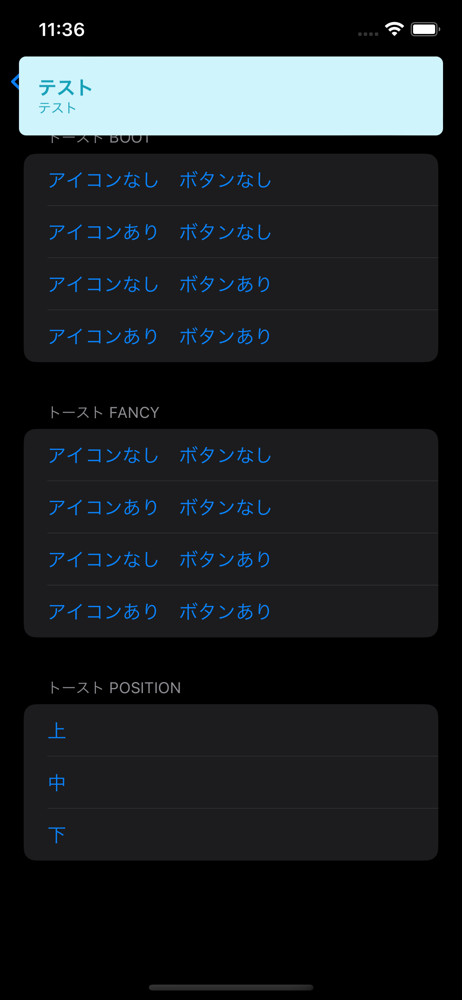
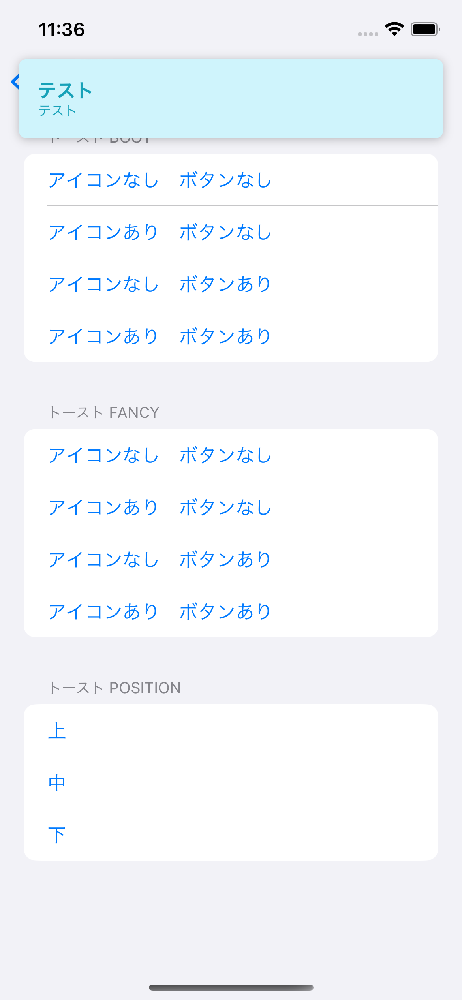
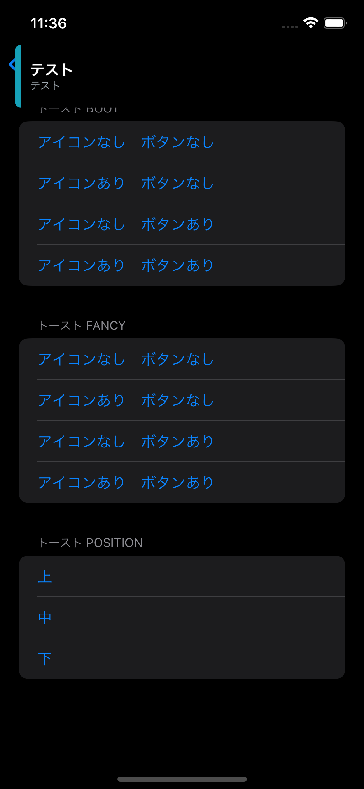
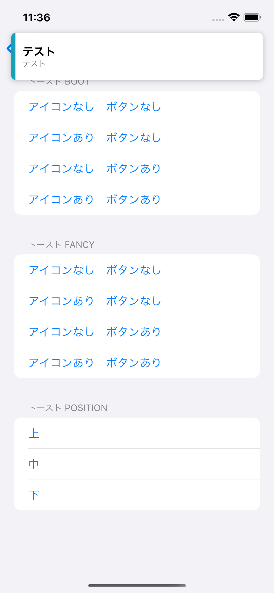
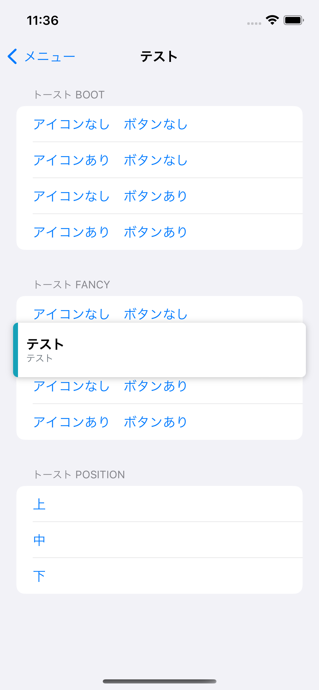
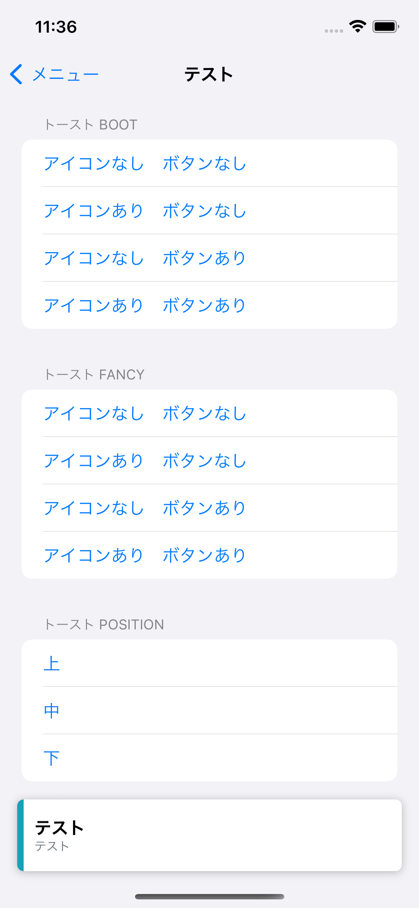

# SwiftToast

A Toast View for SwiftUI

Disclaimer: Most of the codes aren't written by me I found it on a [medium post](https://betterprogramming.pub/swiftui-create-a-fancy-toast-component-in-10-minutes-e6bae6021984) as I was reseaching how to write a toast for Swift. 

## Overview

In addition to the toast, I have added an `ObservableObject` which can will help to coordinate all the toast. You can call `showToast` to add it to the list. 
I would advice you to add it to your root view controller

## Installation 

### Swift Package Manager

Got to `File | Swift Packages | Add Package Dependency...` and paste the github link. Choose `main` branch.

## Screenshots

| Type  | Dark                                   | Light                                    |
| ----- | -------------------------------------- | ---------------------------------------- |
| boot  |    |    |
| fancy |  |  |

|          | top                              | middle                           | bottom                           |
| -------- | -------------------------------- | -------------------------------- | -------------------------------- |
| position |  |  |  |


## Usage

### Import

```swift
import SwiftToast
```

### Root View

```swift
import SwiftToast

struct MenuView: View {
  @ObservedObject var toastCoordinator = ToastCoordinator()
  
  var body: some View {
    VStack {
      Text("Hello World")
    }
    .modifier(ToastModifier())
    .environmentObject(toastCoordinator)
  }
}
```

### Showing Toasts

```swift
import SwiftToast

struct MenuViewTest: View {
  @EnvironmentObject var toastCoordinator: ToastCoordinator
  
  var body: some View {
    VStack {
      Button("no icon, no button") {
        toastCoordinator.showToast(Toast(type: .boot,
                                         title: "test",
                                         message: "test",
                                         duration: 1))
      }
    }
  }
}
```

## License
SwiftToast is distributed under the MIT license. [See LICENSE](./LICENSE.md) for details.
